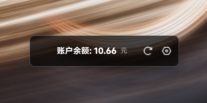
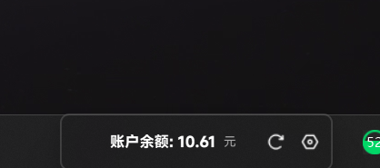

# DeepPenny — 实时显示 DeepSeek API 余额

一个基于 PyQt6 的 Windows 桌面小工具，在任务栏附近显示悬浮窗，定时刷新 DeepSeek API 账户余额，让你随时掌握账户消费状态。

***

## 效果预览

| 桌面悬浮模式 | 吸附到任务栏 |
|:---:|:---:|
|  |  |

*左：悬浮窗在桌面上的独立窗口效果；右：悬浮窗吸附到任务栏右侧，与任务栏融为一体*

***

## 功能特性

### 核心功能

- **实时余额展示** — 定时查询 DeepSeek API 账户余额并显示在悬浮窗上，支持自动重试（最多 3 次，指数退避 1s/2s/4s）
- **设置对话框** — 支持配置 DeepSeek API Key 和刷新间隔，输入时实时校验 Key 格式（必须以 `sk-` 开头），保存后立即生效
- **首次启动引导** — 检测到未配置 API Key 时自动弹出设置窗口，无需手动查找配置文件

### 窗口与交互

- **智能置顶** — 通过 Win32 `SetWinEventHook` 前台事件钩子为主力 + 3s 兜底定时器双重保障，悬浮窗始终保持在任务栏上方，即使点击「开始」菜单或「任务视图」也不会被遮挡
- **吸附到任务栏** — 拖拽移动窗口时目标区域即时显示实线边框引导，进入吸附范围后边框高亮，松开鼠标自动吸附到任务栏右边缘；通过 `snap_offset` 配置吸附偏移量
- **拖拽交互** — 左侧拖拽区域支持鼠标拖拽移动窗口，拖拽时显示吸附指示器
- **悬停装饰** — 鼠标悬停时显示拖拽手柄、关闭按钮等装饰元素，移出后自动隐藏

### 视觉与字体

- **MiSans 字体渲染** — 内置小米 MiSans 字体（Regular + Bold），通过 `QFontDatabase.addApplicationFont` 加载，设置 `PreferNoHinting` 关闭字体微调、`PreferAntialias` 开启抗锯齿，在深色半透明背景上呈现更平滑的视觉效果
- **QSS 样式引擎** — 使用 QSS 文件统一管理样式，支持动态属性切换（如吸附/非吸附、悬停/非悬停状态）
- **SVG 图标渲染** — 使用 `QSvgRenderer` 动态加载 SVG 图标，自动替换 `fill`/`stroke` 颜色以适配不同状态

### 安全与存储

- **安全凭证存储** — 优先使用 keyring 将 API Key 加密存储到 Windows 凭据管理器；当 keyring 不可用时自动回退到 `config.json` 明文存储
- **原子配置文件写入** — 使用临时文件 + `replace()` 原子操作，防止写入过程中崩溃导致 `config.json` 损坏

### 日志与诊断

- **完善的日志系统** — 同时输出到文件（`logs/deep_penny.log`，DEBUG 级别）和控制台（INFO 级别），格式统一为 `[时间] 级别 模块名 | 消息`
- **性能基线测试** — 内置 `benchmark_topmost.py`，可测量 CPU 占用率和 `SetWindowPos` 调用延迟

***

## 环境要求

- **操作系统**：Windows（依赖 Win32 API 实现窗口置顶）
- **Python**：3.9 或更高版本（仅源码运行方式需要）

***

## 安装步骤

### 方式一：使用 EXE 二进制文件（推荐，无需安装 Python）

1. 下载 `DeepPenny.exe`（请从 Releases 页面获取最新版本）
2. 双击运行 `DeepPenny.exe`
3. 首次运行时自动弹出设置窗口，输入你的 [DeepSeek API Key](https://platform.deepseek.com/api_keys)
4. 点击「保存」，浮窗开始显示余额

> 关闭浮窗（点击 `✕`）即可退出程序。API Key 会安全存储在 Windows 凭据管理器中（若 keyring 不可用则存储在 `config.json`），下次启动无需重新输入。

### 方式二：从源码运行（适合开发者）

#### 1. 克隆仓库

```bash
git clone https://github.com/yourusername/DeepPenny.git
cd DeepPenny
```

#### 2. 安装依赖

直接运行一键安装脚本（推荐）：

```bash
install_deps.bat
```

该脚本提供以下功能：

- **必装组件自动安装** — PyQt6（GUI 框架）、httpx（HTTP 客户端），缺失时自动安装
- **可选组件交互式询问** — keyring（凭据存储）、pytest（测试框架）、psutil（性能测试），逐一询问是否安装
- **多镜像源自动切换** — 预设清华、阿里云、中科大、豆瓣 4 个镜像源，按序尝试；连接超时（15 秒）自动切换；全部不可用时回退到官方源（pypi.org）
- **自动验证** — 安装完毕自动验证所有组件能否正常导入
- **自动清理** — 安装后清理 pip 缓存和临时文件

也可手动安装：

```bash
pip install PyQt6>=6.5.0 httpx>=0.27.0
```

可选组件：

```bash
pip install keyring>=24.0.0   # API Key 安全存储
pip install pytest            # 运行测试
pip install psutil            # 性能测试
```

#### 3. 运行程序

```bash
python main.py
```

#### 4. 运行测试（可选）

```bash
pytest tests/ -v
```

***

## 使用指南

### 基本操作

1. **启动程序**：双击 `DeepPenny.exe` 或运行 `python main.py`
2. **配置 API Key**：首次启动会自动弹出设置对话框；也可以随时点击悬浮窗上的齿轮图标打开设置
3. **查看余额**：设置完成后，悬浮窗即显示 `账户余额: xx.xx 元`
4. **手动刷新**：点击悬浮窗上的刷新图标（环形箭头）立即刷新余额
5. **移动窗口**：在左侧拖拽区域按住鼠标左键拖动，可自由移动悬浮窗位置
6. **吸附到任务栏**：将悬浮窗拖拽到任务栏附近，松开鼠标自动吸附；脱离任务栏区域松开鼠标则解除吸附
7. **退出程序**：点击悬浮窗左上角的 `✕` 按钮

### 设置对话框

点击设置齿轮图标打开设置窗口，包含以下配置项：

| 配置项 | 说明 |
|--------|------|
| API 密钥 | 输入 DeepSeek API Key，必须以 `sk-` 开头，输入时隐藏显示 |
| 刷新间隔 | 设置自动刷新余额的时间间隔，范围 10~3600 秒，步进 10 秒 |

点击「保存」后立即生效；点击「取消」放弃更改。

***

## 配置说明

程序运行后会在程序所在目录自动生成 `config.json` 文件（已加入 `.gitignore`，不会上传到 GitHub）。在 keyring 可用（正常情况）时，文件仅包含以下 2 个可编辑参数：

```json
{
  "refresh_interval": 60,
  "snap_offset": 300
}
```

> 编辑前请确保程序已退出，否则修改会被程序覆盖。

### 配置参数详解

| 参数 | 作用 | 默认值 | 修改方式 | 说明 |
|------|------|--------|----------|------|
| `refresh_interval` | 自动刷新间隔（秒） | 60 | 设置对话框 或 编辑 config.json | 取值范围 10~3600，通过设置对话框修改时步进 10 秒 |
| `snap_offset` | 吸附到任务栏后距离右边缘的像素偏移 | 300 | 仅能编辑 config.json | 值越大，悬浮窗越靠左 |

### API Key 存储说明

API Key（DeepSeek 密钥）**不存储在 config.json 中**，由独立的密钥存储模块管理：

- **首选**：通过 keyring 库加密存储到 Windows 凭据管理器（`Windows 凭据` → `通用凭据` → `DeepPenny`）
- **回退**：当 keyring 库未安装时，以明文形式存储在 config.json 中（此时文件才会出现 `api_key` 字段）

修改 API Key 请通过悬浮窗上的齿轮图标打开设置对话框，或直接编辑后通过设置对话框保存。

***

## 主要模块与架构说明

```
DeepPenny/
├── main.py                      # 程序入口：加载配置、创建窗口、启动事件循环
├── requirements.txt             # Python 依赖声明
├── install_deps.bat             # 一键依赖安装脚本（多镜像源切换 + 必装/可选交互）
├── benchmark_topmost.py         # 置顶定时器性能测试脚本
├── config.json                  # 运行时配置文件（自动生成，已加入 .gitignore）
├── fonts/
│   ├── MiSans-Regular.ttf       # MiSans 常规体字体文件
│   └── MiSans-Bold.ttf          # MiSans 粗体字体文件
├── ui/
│   ├── floating_window.py       # 悬浮窗主窗口 + Win32 置顶实现
│   ├── settings_dialog.py       # 设置对话框（API Key 输入、刷新间隔配置）
│   └── snap_manager.py          # 吸附逻辑 + 吸附区域指示器
├── api/
│   └── deepseek_api.py          # DeepSeek API 客户端（余额查询、重试机制）
├── utils/
│   ├── secure_storage.py        # API Key 安全存储（keyring + config 双模式）
│   └── logger.py                # 日志配置（文件 + 控制台双输出）
├── resources/
│   ├── styles.qss               # QSS 样式表（窗口样式、悬停/吸附状态）
│   └── icons/                   # SVG 图标（redo.svg、setting-one.svg）
├── tests/
│   ├── __init__.py
│   └── test_core.py             # 单元测试（API、配置、安全存储、日志）
├── screenshots/
│   ├── floating_window_desktop.png    # 桌面模式截图
│   └── floating_window_snapped.png    # 吸附模式截图
├── CHANGELOG.md                 # 版本更新日志
├── LICENSE.txt                  # MIT 开源许可证
└── .gitignore                   # Git 忽略规则
```

### 模块职责说明

| 模块 | 文件 | 核心职责 |
|------|------|----------|
| **入口** | `main.py` | 加载/保存配置、初始化 API 客户端、创建悬浮窗和吸附管理器、启动 Qt 事件循环 |
| **悬浮窗** | `ui/floating_window.py` | 窗口渲染、SVG 图标加载、MiSans 字体加载、QSS 样式应用、定时刷新、Win32 置顶钩子 |
| **设置对话框** | `ui/settings_dialog.py` | API Key 输入校验、刷新间隔设置、输入错误提示 |
| **吸附管理** | `ui/snap_manager.py` | 任务栏检测、拖拽指示器渲染、吸附/解除吸附逻辑 |
| **API 客户端** | `api/deepseek_api.py` | HTTP 请求、余额数据解析、认证错误/网络错误处理、自动重试（指数退避） |
| **安全存储** | `utils/secure_storage.py` | keyring 加密存储（优先） + config.json 回退、API Key 增删查 |
| **日志系统** | `utils/logger.py` | 文件日志（DEBUG）+ 控制台日志（INFO）、自动创建 logs/ 目录 |

### 关键技术实现

#### 窗口置顶机制（双重保障）

1. **WinEventHook 事件监听（主力）** — 注册 `EVENT_SYSTEM_FOREGROUND` 钩子，前台窗口切换时立即调用 `SetWindowPos(HWND_TOPMOST)` 置顶
2. **3s 兜底定时器** — 每 3 秒调用一次 `SetWindowPos(HWND_TOPMOST)`，防止钩子遗漏的场景

#### 吸附机制（SnapManager + SnapZoneIndicator）

1. **任务栏区域检测** — 通过 `screen.geometry()` 与 `screen.availableGeometry()` 的差值计算任务栏位置（支持底部/右侧任务栏）
2. **视觉引导** — 拖拽过程中在目标位置显示 `SnapZoneIndicator` 半透明实线边框，进入吸附范围后边框高亮（从 alpha 10/2 变为 alpha 80/20）
3. **吸附判定** — 以 `_snap_threshold + 20` 像素（约 50px）的距离阈值判断悬浮窗是否接近任务栏
4. **吸附定位** — 吸附时固定到任务栏右边缘，偏移量由 `snap_offset` 控制（默认 300px），吸附后窗口背景透明化以融入任务栏

#### API 通信与容错

- 使用 `httpx.Client` 长连接复用，减少连接建立开销
- 身份认证失败（401/403）不重试，避免无效请求
- 网络错误/超时最多重试 3 次，指数退避（1s、2s、4s）
- 响应 JSON 解析异常时给出明确的错误提示

#### 安全存储双模式

```python
# 优先使用系统凭据管理器
if HAS_KEYRING:
    keyring.set_password("DeepPenny", "api_key", api_key)
# 回退到配置文件
else:
    config["api_key"] = api_key  # 写入 config.json
```

#### 性能基线

以下数据基于 `benchmark_topmost.py` 实际测试获得（测试环境：3s 兜底定时器 + 1000 次 `SetWindowPos` 调用采样）：

| 指标 | 数值 |
|:---|:---:|
| SetWindowPos 平均延迟 | 58.96 µs |
| SetWindowPos 中位延迟 | 48.00 µs |
| SetWindowPos P99 延迟 | 290.10 µs |
| CPU 增量（定时器开启 - 关闭） | +1.51% |
| 5Hz 下每秒 CPU 开销 | 0.295 ms |
| **整体评价** | **延迟极低（约 59 µs），CPU 影响轻微，对系统性能无感知影响** |

通过以下命令在本地复现性能测试：

```bash
python benchmark_topmost.py
```

测试结果会输出到终端并保存到 `benchmark_report.txt`，DEBUG 级别日志输出到 `benchmark_debug.log`。

***

## 如何获取 API Key

1. 访问 [DeepSeek 开放平台](https://platform.deepseek.com/api_keys)
2. 登录后点击「创建 API Key」
3. 复制生成的 Key（以 `sk-` 开头）
4. 粘贴到程序的设置对话框中

***

## 依赖项

### 必装组件（程序运行必需）

| 包 | 用途 | 安装命令 |
|----|------|----------|
| [PyQt6](https://pypi.org/project/PyQt6/) | 桌面 GUI 框架 | `pip install "PyQt6>=6.5.0"` |
| [httpx](https://pypi.org/project/httpx/) | HTTP 客户端，调用 DeepSeek API | `pip install "httpx>=0.27.0"` |

### 可选组件（按需安装）

| 包 | 用途 | 安装后可用的功能 |
|----|------|------------------|
| [keyring](https://pypi.org/project/keyring/) | API Key 安全存储到系统凭据管理器 | 加密保存密钥，替代明文 config |
| [pytest](https://pypi.org/project/pytest/) | Python 测试框架 | 运行 `pytest tests/ -v` |
| [psutil](https://pypi.org/project/psutil/) | 系统资源监控 | 运行 `benchmark_topmost.py` |

***

## 常见问题解答

### Q: 启动后悬浮窗没有显示余额？

可能的原因及解决方案：

1. **未配置 API Key** — 点击齿轮图标打开设置，输入有效的 DeepSeek API Key（需以 `sk-` 开头）
2. **网络连接问题** — 检查网络是否正常，程序会自动重试最多 3 次
3. **API Key 无效** — 检查 API Key 是否已过期或余额不足，程序会显示具体错误信息

### Q: 如何修改刷新间隔？

两种方式：

- **图形界面**：点击悬浮窗上的齿轮图标，在设置对话框中修改「刷新间隔」
- **直接编辑配置文件**：在程序所在目录找到 `config.json`，修改 `refresh_interval` 值（单位：秒，范围 10~3600）

### Q: 如何修改吸附位置偏移量？

打开程序所在目录的 `config.json`，修改 `snap_offset` 值（默认 300，单位：像素）。值越大，悬浮窗越靠左。

### Q: 悬浮窗被其他窗口遮挡了怎么办？

程序内置了双重置顶保障机制：

- 前台事件钩子：每次切换窗口时自动将悬浮窗置顶
- 兜底定时器：每 3 秒强制置顶一次

通常情况下无需手动干预。如果仍然出现遮挡问题，请检查是否有其他程序也使用了 `TopMost` 窗口属性。

### Q: 点击开始菜单或任务视图后，吸附在任务栏的悬浮窗被遮挡了怎么办？

无需操作，稍等片刻，兜底定时器（3 秒间隔）会自动将悬浮窗重新置顶。

### Q: API Key 存储在哪里？

优先使用 Windows 凭据管理器（通过 keyring 库），存储位置为 Windows 凭据管理器中的 `Windows 凭据` → `通用凭据` → `DeepPenny`。当 keyring 不可用时，API Key 会存储在程序所在目录的 `config.json` 文件中（明文形式）。

### Q: 如何卸载？

- **EXE 版本**：直接删除 `DeepPenny.exe` 文件和同目录下的 `config.json` 即可
- **源码版本**：删除项目文件夹即可
- **清理凭据**：如需同时清除 Windows 凭据管理器中的 API Key，打开「凭据管理器」→「Windows 凭据」→「通用凭据」，找到 `DeepPenny` 并删除

***

## 贡献指南

欢迎提交 Issue 和 Pull Request 来帮助改进 DeepPenny。

### 开发流程

1. Fork 本仓库
2. 创建你的特性分支：`git checkout -b feature/amazing-feature`
3. 提交你的更改：`git commit -m 'Add some amazing feature'`
4. 推送到分支：`git push origin feature/amazing-feature`
5. 提交 Pull Request

### 代码规范

- 遵循现有代码风格（PEP 8 指导原则）
- 所有新功能应包含相应的单元测试
- 确保现有测试全部通过：`pytest tests/ -v`

### 测试指南

```bash
# 运行全部测试
pytest tests/ -v

# 运行特定测试文件
pytest tests/test_core.py -v

# 运行特定测试类
pytest tests/test_core.py::TestDeepSeekAPIBalanceParsing -v
```

***

## 许可证

本项目基于 MIT License 开源，版权所有 (c) 2026 刻度愚蠢。详见 [LICENSE.txt](LICENSE.txt)。

***

## 更新日志

各版本变更详情请查看 [CHANGELOG.md](CHANGELOG.md)。
